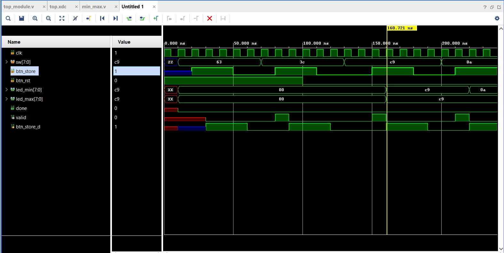
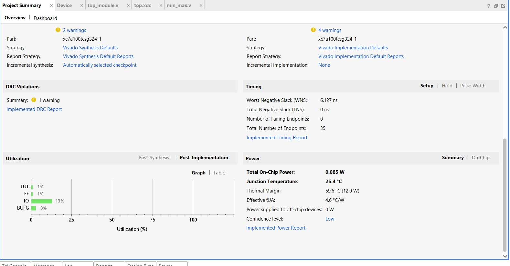

# 🚀 FPGA-Based Real-Time Min–Max Finder  
### Streaming Hardware Accelerator on Artix-7 (Nexys 4 DDR)

---

## 📌 Project Summary

This project implements a **real-time streaming Min–Max computation engine** on the **Nexys 4 DDR FPGA (Artix-7)** using Verilog HDL.

Unlike software-based approaches that store the full dataset, this design follows a **streaming dataflow architecture**, updating minimum and maximum values incrementally as each input arrives — minimizing memory usage and enabling real-time performance.

The design was implemented, synthesized, and tested on hardware using **Vivado 2023.2**.

---

## 🎯 Problem Statement

Given `N` unsigned `W`-bit inputs:

\[
\text{MIN} = \min(x_1, x_2, ..., x_N)
\]

\[
\text{MAX} = \max(x_1, x_2, ..., x_N)
\]

The system must:

- Capture inputs using FPGA switches
- Process each value sequentially
- Display final min and max
- Assert a DONE signal after N inputs

---

## 🧠 Key Engineering Concepts

This project demonstrates:

✔ Synchronous Sequential Design (100 MHz clock)  
✔ Combinational Comparator Logic  
✔ Edge Detection for Asynchronous Inputs  
✔ Streaming Hardware Architecture  
✔ Parameterized RTL Design  
✔ Structural + Behavioral Modeling  
✔ FPGA Timing Constraint Management  
✔ Hardware Resource Optimization  

---

## 🏗 System Architecture

Switches → data_in.
Button → Edge Detector → valid (1-cycle pulse).
Clock → Sequential Registers.
Comparator Logic → min_val / max_val.
Counter → Input Tracking.
DONE Flag → Completion Indicator.
LEDs → Output Display.

---

## ⚙️ Hardware Specifications

| Component | Description |
|------------|------------|
| FPGA Board | Nexys 4 DDR |
| FPGA Chip | Xilinx Artix-7 |
| Clock | 100 MHz onboard oscillator |
| Inputs | 8-bit switches |
| Output | 16 LEDs (min + max) |
| Completion | DONE LED |

---

---

## 🔄 Design Flow

1. Press RESET → Registers initialized  
2. Set input value using switches  
3. Press STORE → Rising-edge generates valid pulse  
4. First input initializes min & max  
5. Each new input updates:
   - `min_val` if smaller  
   - `max_val` if larger  
6. After `N` inputs:
   - DONE = 1  
   - Processing stops  
   - Results remain stable  

---

## 🧪 Example Test Case

**Inputs (Decimal):**

| Value | Role |
|--------|------|
| 16     | —    |
| 1      | MIN  |
| 40     | —    |
| 42     | MAX  |
| 6      | —    |

**Final Output:**

MIN = 1
MAX = 42
DONE = 1

---

## 📸 Demonstration

### 🔹 FPGA – Final Output (DONE Asserted)
After N inputs are entered, DONE signal is asserted and final MIN and MAX values are displayed.

---

### 🔹 Simulation Waveform
Waveform confirming that `min_val` and `max_val` update only on valid pulse.

---

### 🔹 Vivado Resource Utilization Report
Hardware resource usage summary from Vivado.

